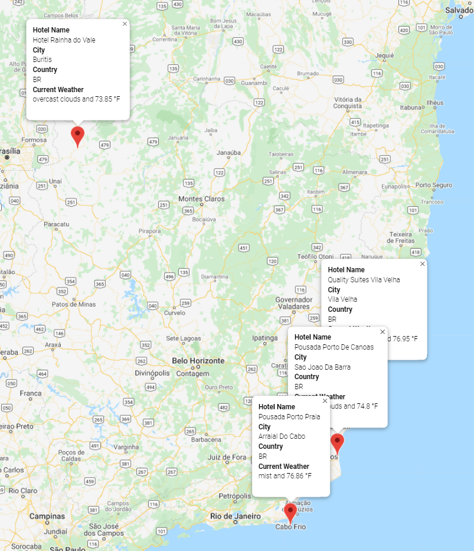

# WorldWeather Analysis - Module 6 Challenge

## Overview of the Analysis

The purpose of this analysis is to create a series of maps that could be produced by a PlanMyTrip App with the use of of APIs for analyzing the weather in cities and determining locations for travel based on customer input of temperatures.

## Resources Used
- Software: Python 3.7.6, Visual Studio Code 1.63.2, Conda 4.11.0, Jupyter Notebook 6.4.6, CityPy
- APIs: Google Maps, OpenWeatherMap

## Results

### Weather Data Summary

A csv file containing weather data was created and placed in the Weather_Database folder.  This was created by randomizing a list of latitudes and longitudes, checking them with the CityPy Module to find the cities that may match them, then using the OpenWeatherMap module to retrieve weather data for wach of the cities, eliminating the results that could not retrieve data or match a city.

### Customer Travel Map

Using the Google Maps API, a map was created based on two inputs of minimum and maximum temperature by the user. This data filtered the previous database created for the Weather Data Summary. The Google API was then used to search for hotels in each city, with the first hotel for each being used for the analysis. Cities that could not produce a hotel were dropped from the database.

An example of the map with info boxes populated has been produced below.

### Itinerary Travel Map
The Google Directions API was used to further elaborate on the hotel data, where 4 locations were picked to test using the API to produce directions between four locations. For this analysis, four locations in Brasil were chosen for travel. The map produced was shown below.

To further support travel planning, a second map was produced using refactored code that was used to populate the initial customer travel map, as shown.

## Summary

Overall the maps were created successfuly. Future iterations of the code could be used to take more information from the user or apply settings, such as asking them to manually input the names of the cities they may want to travel between to make an itinerary travel map, or preferences on things like temperature in Fahrenheit and Celcius.